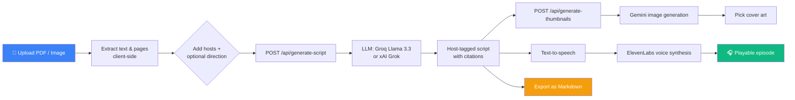
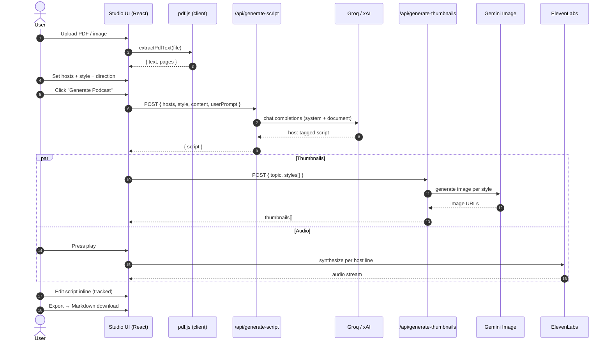
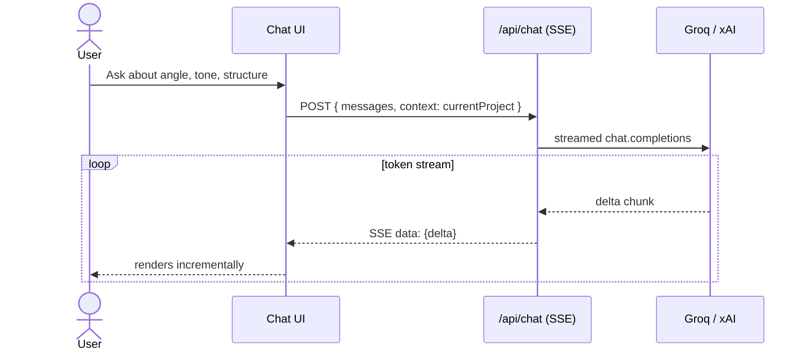
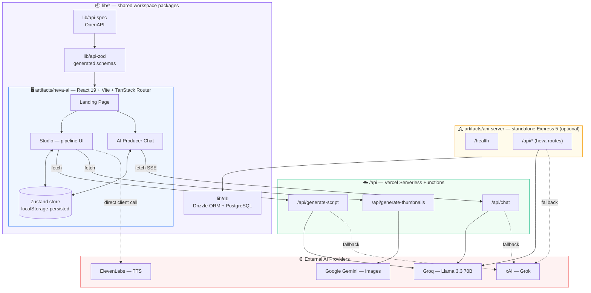

<div align="center">

# 🎙️ Heva AI — `personacast-ai`

### Turn any PDF into an insightful, listenable podcast conversation.

Upload a document → AI reads it → two AI hosts discuss it → you get a script, cover art, and audio.

[](https://www.typescriptlang.org/)
[](https://react.dev/)
[](https://pnpm.io/)
[](https://personacast-ai.vercel.app)
[](#license)

[**Live Demo**](https://personacast-ai.vercel.app) · [Features](#-features) · [Architecture](#-architecture) · [Getting Started](#-getting-started) · [API](#-api-reference)

</div>

---

## 📖 Overview

**Heva AI** (this repo) is a **document-to-podcast engine**. Drop in a PDF or image, pick your two hosts, and Heva:

1. **Reads** the document client-side (PDF text extraction, page-aware).
2. **Writes** a natural, two-host conversational script grounded in that content — citations included.
3. **Illustrates** it with AI-generated cover art matched to the topic.
4. **Voices** it into playable audio with distinct host voices.
5. **Lets you edit, iterate, and export** the whole thing — script, audio, or a Markdown package.

There's also a standalone **AI producer chat** for brainstorming angles, tone, and structure before (or after) you generate.

> Built as a fast, focused take on "NotebookLM-style" document intelligence — optimized for a tight, believable end-to-end pipeline rather than every possible feature.

---

## ✨ Features

| | |
|---|---|
| 📄 **Smart Document Ingestion** | Client-side PDF text + page extraction, plus image sources, combined into one context window |
| 🎭 **Custom Hosts** | Name and role your own podcast hosts — the script is generated to match them exactly |
| 🗣️ **Directable Generation** | Optional free-text direction ("make it a 3-minute debate with humor") steers tone, length, and format |
| 📝 **Structured, Editable Script** | Host-tagged dialogue lines, `[cite: page N]` markers, inline manual editing with change tracking |
| 🎨 **AI Cover Art** | Multiple style variants generated per script, pick your favorite thumbnail |
| 🔊 **Text-to-Speech Playback** | Script converted to multi-voice audio in the Studio |
| 💬 **AI Producer Chat** | A separate streaming chat assistant for podcast strategy, aware of your current project |
| 📦 **One-Click Export** | Download the script (and metadata) as a shareable Markdown file |
| 💾 **Local-First Projects** | Multiple projects persisted client-side (Zustand + persist) — no login required to try it |

---

## 🧭 How It Works



### The Studio pipeline, step by step



### AI Producer Chat (separate from the Studio pipeline)



---

## 🏗️ Architecture

This is a **pnpm workspace monorepo**. The deployed product (`personacast-ai.vercel.app`) is the `heva-ai` artifact; a separate standalone Express API server exists for non-Vercel / local full-backend usage.



**Why two backends?** `/api/*.ts` are lightweight Vercel functions used by the deployed demo. `artifacts/api-server` is a full Express 5 server (with the same routes, plus health checks) for running the whole stack outside Vercel — e.g. with a real Postgres-backed persistence layer via `lib/db`, rather than the browser-only Zustand store.

---

## 📂 Project Structure

```
personacast-ai/
├── api/                          # Vercel serverless functions (deployed backend)
│   ├── chat.ts                   #   streaming AI producer chat
│   ├── generate-script.ts        #   PDF/content → podcast script
│   └── generate-thumbnails.ts    #   script/topic → cover art
│
├── artifacts/
│   ├── heva-ai/                  # ⭐ the actual product (React 19 + Vite)
│   │   └── src/
│   │       ├── pages/            #   Landing, Studio, Chat, NotFound
│   │       ├── components/       #   Sidebar, Stepper, HostsEditor, AudioPlayer,
│   │       │                     #   StudioPreview, + 55 shadcn/ui primitives
│   │       ├── services/         #   elevenlabs.ts (TTS), geminiImage.ts (images)
│   │       ├── lib/               #   store.ts (Zustand), pdf.ts (extraction)
│   │       └── routes/            #   TanStack Router route tree + API mirrors
│   │
│   ├── api-server/               # standalone Express 5 backend (optional / local)
│   │   └── src/
│   │       ├── routes/heva.ts    #   chat / generate-script / generate-thumbnails
│   │       └── routes/health.ts
│   │
│   └── mockup-sandbox/           # design/prototyping playground
│
├── lib/
│   ├── db/                       # Drizzle ORM schema + PostgreSQL client
│   ├── api-spec/                 # OpenAPI source of truth
│   ├── api-zod/                  # generated Zod schemas
│   └── api-client-react/         # generated TanStack Query hooks (via Orval)
│
├── scripts/                      # workspace tooling (post-merge hooks, etc.)
├── pnpm-workspace.yaml           # workspace + shared dependency catalog
└── vercel.json                   # build/output config for the deployed app
```

---

## 🧰 Tech Stack

<table>
<tr><td><b>Frontend</b></td><td>React 19 · TypeScript 5.9 · Vite 7 · TanStack Router · Zustand · Tailwind CSS · shadcn/ui (Radix primitives) · Framer Motion · Wouter</td></tr>
<tr><td><b>AI / Generation</b></td><td>Groq (Llama 3.3 70B) with xAI Grok fallback for script + chat · Google Gemini for image generation · ElevenLabs for text-to-speech</td></tr>
<tr><td><b>Backend</b></td><td>Vercel Serverless Functions (deployed) · Express 5 (standalone server option)</td></tr>
<tr><td><b>Data</b></td><td>PostgreSQL + Drizzle ORM (optional persistence layer) · Zustand + localStorage (client-first default)</td></tr>
<tr><td><b>API Layer</b></td><td>OpenAPI spec → Zod schemas → generated React Query hooks via Orval</td></tr>
<tr><td><b>Tooling</b></td><td>pnpm workspaces · esbuild · tsc project references</td></tr>
<tr><td><b>Deployment</b></td><td><a href="https://personacast-ai.vercel.app">Vercel</a></td></tr>
</table>

---

## 🚀 Getting Started

### Prerequisites

- **Node.js 24**
- **pnpm** (this repo refuses `npm`/`yarn` installs by design — see `preinstall` script)

### 1. Clone & install

```bash
git clone https://github.com/Anurag13075/personacast-ai.git
cd personacast-ai
pnpm install
```

### 2. Configure environment variables

Create a `.env` (or set these in your platform's secrets) with **at least one** LLM key:

| Variable | Used for | Required |
|---|---|---|
| `GROQ_API_KEY` | Script generation + AI chat (primary) | ✅ one of Groq/xAI |
| `XAI_API_KEY` | Script generation + AI chat (fallback) | ✅ one of Groq/xAI |
| `VITE_GEMINI_API_KEY` | AI cover art generation | for thumbnails |
| `VITE_ELEVENLABS_API_KEY` | Text-to-speech playback | for audio |
| `VITE_ELEVENLABS_VOICE_ID` | Default TTS voice (has a sane default) | optional |
| `DATABASE_URL` | Postgres connection (only if using `lib/db` / `api-server` persistence) | optional |

### 3. Run the app

```bash
# Deployed-style: Vite dev server + Vercel functions
pnpm --filter @workspace/heva-ai run dev

# OR, run the standalone Express API server instead
pnpm --filter @workspace/api-server run dev   # http://localhost:5000
```

### 4. Other useful scripts

```bash
pnpm run typecheck                                        # typecheck everything
pnpm run build                                             # typecheck + build all packages
pnpm --filter @workspace/api-spec run codegen               # regenerate API hooks/schemas from OpenAPI
pnpm --filter @workspace/db run push                        # push Drizzle schema (dev only)
```

---

## 🔌 API Reference

| Endpoint | Method | Body | Returns |
|---|---|---|---|
| `/api/generate-script` | `POST` | `{ hosts, style, content, userPrompt? }` | `{ script }` — host-tagged dialogue with citations |
| `/api/generate-thumbnails` | `POST` | `{ topic, styles: string[] }` | `{ results: [{ url }] }` — one image per style |
| `/api/chat` | `POST` | `{ messages, context? }` | `text/event-stream` — streamed producer-assistant reply |

All three endpoints prefer `GROQ_API_KEY` and transparently fall back to `XAI_API_KEY` if Groq isn't configured, so you only need one LLM provider to run the core pipeline.

---

## 🗺️ Roadmap

- [ ] Server-side persistence for projects (via `lib/db`) instead of local-only storage
- [ ] Multi-speaker audio stitching into a single downloadable episode file
- [ ] Auto-generated show notes, chapters, and quote pulls (UI scaffolding already present)
- [ ] Social share kit export
- [ ] Auth + team workspaces

---

## 🤝 Contributing

Issues and PRs are welcome. This is a pnpm workspace — please keep changes scoped to the relevant package (`artifacts/*`, `lib/*`, or `scripts`) and run `pnpm run typecheck` before opening a PR.

## 📄 License

MIT © [Anurag](https://github.com/Anurag13075)

---

<div align="center">
<sub>Built by <a href="https://github.com/Anurag13075">@Anurag13075</a> · <a href="https://x.com/AnuragShar74342">@AnuragShar74342</a></sub>
</div>
